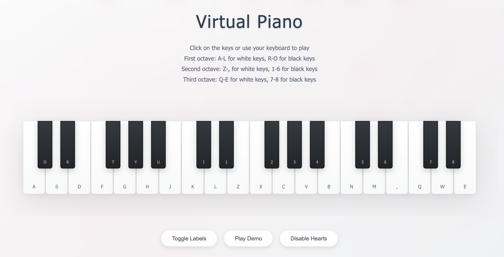

# 🎹 Virtual Piano

A beautiful, interactive virtual piano with floating baby pink hearts and aesthetic decorations. Play music using your keyboard or mouse clicks with a clean, calming design.

   

## ✨ Features

- 🎵 **21 Piano Keys** - Extended keyboard with 3 octaves
- 💕 **Floating Hearts** - Baby pink hearts that appear when playing
- 🎨 **Aesthetic Design** - Clean, calm, and beautiful interface
- 🎹 **Dual Input** - Play with mouse clicks or keyboard
- 🎼 **Demo Song** - Built-in "Twinkle Twinkle Little Star" demo
- 📱 **Responsive Design** - Works on desktop, tablet, and mobile
- 🔊 **Web Audio API** - High-quality sound generation
- 🌸 **Decorative Elements** - Subtle particles and wave animations
- 🎛️ **Control Panel** - Toggle labels, hearts, and play demo

## 🎮 How to Play

### Keyboard Controls

**First Octave:**
- **White Keys:** A, S, D, F, G, H, J
- **Black Keys:** W, E, T, Y, U

**Second Octave:**
- **White Keys:** K, L, Z, X, C, V, B, N, M, ,
- **Black Keys:** I, 1, 2, 3, 4, 5, 6

**Third Octave:**
- **White Keys:** Q, W, R
- **Black Keys:** 7, 8

### Mouse Controls
Simply click on any piano key to play the corresponding note.

## 🚀 Installation

1. **Clone the repository:**
2. **Run the `index.html` file on ur browser**

## here is a little demo 🩷

